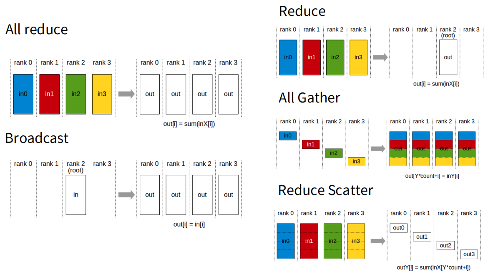
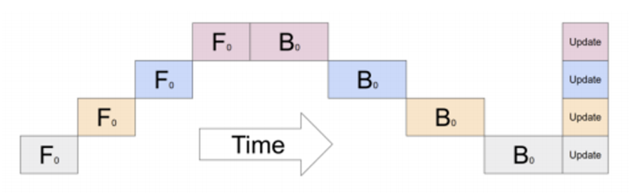
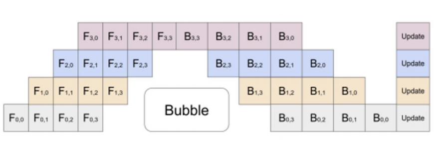
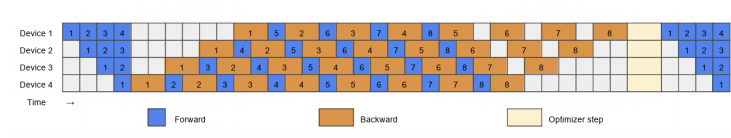
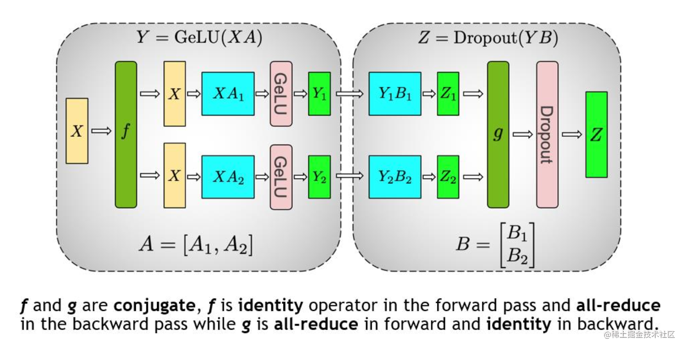
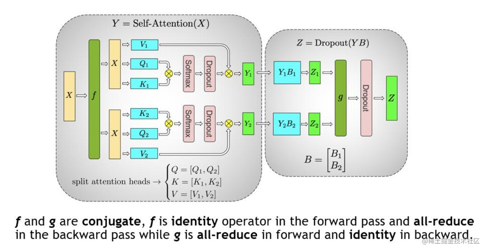
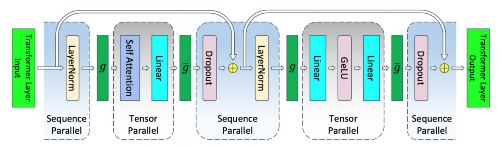
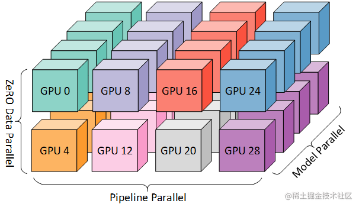

# Distributed Training

## 1. 通信原语

所有高级的并行算法最终都是通过调用底层的集体通信原语来实现的.

## 1.1 All-Reduce (全规约)

全规约是指对所有 `rank` (计算单元, 如 GPU) 的输入数据执行一个规约操作 (如求和), 并将最终的相同结果分发给所有参与的 `rank`.

数据流详解:
1. **初始状态**: 每个 `rank` 持有一个独立的输入缓冲区. 例如, `rank 0` 持有 `in0`, `rank 1` 持有 `in1`, `rank 2` 持有 `in2`, `rank 3` 持有 `in3`.
2. **操作过程**: 系统逻辑上收集所有输入 (`in0` 到 `in3`), 对它们进行逐元素求和, 得到一个最终的聚合结果 `out = in0 + in1 + in2 + in3`. 随后, **这个单一的聚合结果 out 被广播回所有参与的 rank**.
3. **最终状态**: 操作完成后, `rank 0` 到 `rank 3` 的输出缓冲区中都包含了完全相同的聚合结果 `out`. 这是一个 **"多对多" (many-to-many)** 的同步操作.

## 1.2 Broadcast (广播)

广播是指一个指定的 `rank` (称为 `root`) 将其持有的数据精确复制给所有其他的 `rank`.

数据流详解:
1. **初始状态**: 只有一个 `rank` 持有有效数据 `in`. 其他 `rank` 的相应缓冲区是空的或将被覆盖.
2. **操作过程**: `root rank` 将存在其输入缓冲区的数据 in 发送出去. **网络基础设施将这份数据复制并分发给所有其他 `rank (rank 0, rank 1, rank 3)`.**
3. **最终状态**: 所有 `rank` 的输出缓冲区中都包含了与 `root rank` 原始数据 `in` 完全相同的一份副本. 这是一个 **"一对多" (one-to-many)** 的分发操作.

## 1.3 Reduce (规约)

规约是指对所有 `rank` 的输入数据进行规约操作, 但最终结果只发送给一个指定的 `root rank`.

数据流详解:
1. **初始状态**: 与 `All-Reduce` 相同, 每个 `rank` 都持有自己的输入数据.
1. **初始状态**: 系统逻辑上收集所有输入, 计算聚合结果 `out = in0 + in1 + in2 + in3`. 但与 `All-Reduce` 不同, **这个结果 `out` 仅被发送到指定的 `root rank`**.
3. **最终状态**: 只有 `root rank` 的输出缓冲区中包含了聚合结果 `out`. 其他 `rank` 的输出缓冲区内容未定义或保持不变. 这是一个 **"多对一" (many-to-one)** 的聚合操作.

## 1.4 All-Gather (全收集)

全收集是指每个 `rank` 持有整体数据的一个分片. 操作完成后, 所有 `rank` 都会得到由所有分片按 `rank` 顺序拼接而成的完整数据集.
数据流详解:
1. **初始状态**: 数据是分布式的. `rank 0` 持有分片 `in0`, `rank 1` 持有分片 `in1`, 以此类推.
2. **操作过程**: **每个 rank 将自己的分片发送给所有其他 rank**. 例如, `rank 0` 将 `in0` 发送给 `rank 1, 2, 3`; `rank 1` 将 `in1` 发送给 `rank 0, 2, 3`, 依此类推. 每个 rank 同时接收来自其他所有 `rank` 的分片.
3. **最终状态**: 所有 rank 的输出缓冲区都包含了按 `rank` 顺序聚合的完整数据 `[in0, in1, in2, in3]`.

## 1.5 Reduce-Scatter (规约-散播)

规约-散播是一个复合操作, 它首先对所有 `rank` 的输入数据进行规约 (求和), 然后将聚合后的结果切分成 N 个块, 并将第 i 个块分发给第 i 个 `rank`.

数据流详解:
1. **初始状态**: 每个 `rank` 持有完整的输入缓冲区. 为了理解这个操作, 我们需要将每个输入 `in_k` 想象成在逻辑上被预先切分成了 N 个块: `in_k = [chunk_k0, chunk_k1, ..., chunk_k(N-1)]`.
2. **操作过程 (逻辑上)**:
- 规约阶段: **系统对每一个块索引分别进行求和**. 例如, 第一个输出块 `out0` 是所有输入的第一个块之和: `out0 = chunk_00 + chunk_10 + chunk_20 + ....` 第二个输出块 `out1` 是所有输入的第二个块之和, 依此类推.
- 散播阶段: 计算完成后, 系统将聚合好的 `out0` 发送给 `rank 0`, `out1` 发送给 `rank 1`, 以此类推.
3. **最终状态**: 每个 `rank` 只收到完整聚合结果的一个分片. `rank 0` 的输出是 `out0`, `rank 1` 的输出是 `out1`, 等等. 没有任何一个 `rank` 拥有完整的求和结果.

## 1.6 数据并行中的梯度同步

一个经典的数据并行操作:假设有 4 个 GPU, 每个 GPU 计算出了一个完整的梯度向量 $G_0, G_1, G_2, G_3$. 我们的目标是计算全局总梯度 $G_{sum} = \sum G_i$, 并确保每个 GPU 都拥有这份总梯度.

- **方法一 (All-Reduce)**: 所有 GPU 调用一次 `All-Reduce`, 直接得到完整的 $G_{sum}$.
- **方法二 (Reduce-Scatter + All-Gather)**:
  1. **Reduce-Scatter**: 每个 GPU (例如 GPU $k$) 最终只获得 $G_{sum}$ 的第 $k$ 个分块.
  2. **(参数更新后) All-Gather**: 每个 GPU 将自己已更新的参数块广播给所有人, 最终拼接成完整的模型参数.

这个例子生动地展示了 `All-Reduce` 操作在效果和带宽成本上, 都等价于执行一次 `Reduce-Scatter` 紧接着执行一次 `All-Gather`. 这种分解为在通信之间插入计算创造了机会, 是实现 ZeRO 等高级优化算法的关键.

## 1. 数据并行 (Data Parallelism)

数据并行 (DP) 是并行化策略中最直观的起点. 它的核心理念非常简单: 复制模型, 切分数据. 每一台设备 (GPU) 都拥有一份完整的模型副本, 但只处理整个训练批次 (batch) 的一个子集.

### 1.1 分布式数据并行 (Distributed Data Parallel, DDP)

分布式数据并行 (DDP) 是基于多进程进行实现的, 每个进程都有独立的优化器, 执行自己的更新过程. 每个进程都执行相同的任务, 并且每个进程都与所有其他进程通信.

我们从分布式梯度更新入手, 随机梯度下降 (SGD) 算法的核心更新公式为:

$$
w_{t+1} = w_t - \eta \frac{1}{B} \sum_{i=1}^{B} \nabla L(w_t; x_i, y_i)
$$

这个公式的本质是: 对一个批次中的所有样本计算梯度, **将这些梯度累加起来**, 然后用这个聚合后的梯度来更新模型参数.

具体的数据并行化过程是:
- 将一个大小为 B 的全局批次切分成 N 份.
- 将这 N 份数据分发给 N 个 GPU.
- 每个 GPU 独立完成前向和反向传播, 计算出其数据子集的梯度.
- 在更新参数之前, 所有 GPU 通过一次集体通信 (通常是 `All-Reduce`) 交换并同步梯度, 计算出全局的总梯度.
- 所有 GPU 使用完全相同的全局梯度来更新各自的模型副本, 确保模型在下一次迭代开始前保持一致.

性能分析:

- **计算扩展性**: **高**. 只要全局批次大小足够大, 每个 GPU 分到的微批次 (micro-batch) 就能充分利用其计算单元. 理论上, 我们可以获得近乎线性的计算加速.
- **通信开销**: **可忽略**, 每次迭代都需要一次 `All-Reduce` 操作来同步梯度. 其通信量约等于**两倍的模型参数量**. 这个开销是固定的, 当批次很大时, 计算所需的时间足够长, 往往可以有效地掩盖 (mask) 掉通信延迟, 使其不成为瓶颈.
- **内存扩展性**: **差**. 内存扩展性为 0. 每个 GPU 都需要复制一份完整的模型参数, 梯度, 以及最占空间的优化器状态.

对于一个使用 Adam 优化器混合精度训练的 FP16 格式存储的模型, 每个参数需 16 个字节的存储空间:
- **参数**: 2 Byte (FP16)
- **梯度**: 2 Byte (FP16)
- **优化器状态**: 共 12 Byte:
  - **主权重**: 4 Byte (FP32)
  - **一阶矩估计/动量**: 4 Byte (FP32)
  - **二阶矩估计/方差项**: 4 Byte (FP32)

故我们需要一个算法来跨越这个"内存墙".

### 1.2 完全分片数据并行 (FSDP)

完全分片数据并行 (FSP) 主要是依靠将上述提到的参数, 梯度以及优化器状态都进行分片, 存储在不同的 GPU 上, 在计算时才进行聚合计算, 以此来缓解显存占用不够的问题. 详见 **[FSDP (See 3)](./ZeRO.md)**.

### 1.3 数据并行的局限性: 临界 Batch Size

对于数据并行, 批次大小(Batch Size)是一个至关重要的参数, 因为你无法将并行化的数量设定得比批次中的样本数量更高. 这意味着无法通过无限增加机器大小来进行数据并行加速, 同时, **增加批次大小带来的训练速度收益是递减的**.

**[Scaling Laws](../Pretrain/Scaling_Laws.md)** 中的 2.2.1 节中我们讨论了**临界 Batch Size**, 当 Batch Size 超过临界 Batch Size 时, 梯度的精度已经足够高，进一步增大批次并不会明显改善方向. 相反, 因为需要处理海量数据, 计算一个梯度批次的时间会大幅增加. 这时**瓶颈**变成了**在有限时间内能够执行的更新步骤** (即增加单位时间内的梯度更新次数, 收敛反而更快). 因此, 单靠数据并行并不能实现这种加速, 需要一种新的并行方式.

## 2. 模型并行 (Model Parallelism)

当数据并行 (即便是 FSDP) 走到尽头——模型本身大到单个 GPU 根本无法容纳其参数时——我们必须转向模型并行 (Model Parallelism, MP). 其核心思想不再是复制模型、切分数据, 而是**切分模型本身**, 将模型的不同部分部署在不同的设备上.

在模型并行中, 设备间通信的主要内容从梯度变成了****激活值 (Activations)**. 这与 ZeRO-3 (FSDP) 有本质区别: FSDP 在计算时需要通过 `All-Gather` **临时重构完整的参数层**, 通信的是**参数**; 而模型并行中, 参数固定在各自的设备上, 设备间传递的是计算的中间结果, 即**激活值**. 而激活值的尺寸往往远小于参数, 这带来了通信上的潜在优势.

模型并行分为张量并行和流水线并行. 张量并行为**层内并行**, 对模型 Transformer 层内进行分割. 流水线为**层间并行**, 对模型不同的 Transformer 层间进行分割.

### 2.1 流水线并行 (Pipeline Parallelism, PP)

流水线并行按模型的**深度 (depth)** 轴, 即按**层**进行划分.

#### 2.1.1 流水线并行策略

流水线并行根据执行的策略, 可以分为 F-then-B 和 1F1B 两种模式:

1. **F-then-B 策略**: 先进行前向传播的计算, 再进行反向传播的计算. 该策略要求缓存中间变量和梯度, 显存实际利用率不高.
2. **1F1B 策略 (One Forward pass followed by One Backward pass)**: 一种前向传播和反向传播交叉计算的方式. 前向计算和反向计算交叉进行, 可以及时释放不必要的中间变量.

#### 2.1.2 朴素流水线并行

一次只处理一个数据批次. 在任何时刻, 只有一个 GPU 在工作, 其余 GPU 都在空闲等待. 这个空闲时间被称为 **"流水线气泡 (Bubble)"**. GPU 平均利用率为 1/N.

#### 2.1.3 微批次流水线并行

微批次 (MicroBatch) 流水线并行与朴素流水线几乎相同, 但它通过将传入的小批次 (MiniBatch) 分块为微批次, 并人为创建流水线来解决 GPU 空闲问题, 从而允许不同的 GPU 同时参与计算过程, 可以显著提升流水线并行设备利用率, 减小设备空闲状态的时间.

GPipe 是一种典型的微批次流水线, 在该流水线并行下, Bubble 时间为 O($\frac{K - 1}{K + M - 1}$). 其中 K 为设备, M 为将 MiniBatch 切分为多少个 MicroBarch. 当 M >> K 时, 这个时间可以忽略不计.

同时, GPipe 还通过**重计算**降低显存消耗. 在前向传播过程中, 记录每个算子的计算结果, 同于反向传播的梯度计算. 而 Re-materialization 可以不用保存中间层输出的激活值, 在计算梯度的时候会重新计算这些激活值.

#### 2.1.4 PipeDream (非交错式 1F1B)

Gpipe 的流水线有以下几个问题:

- 将 mini-batch 切分成 m 份 micro-batch 后, 将带来更频繁的流水线刷新 (Pipeline flush). 这降低了硬件效率, 导致空闲时间的增加.
- 将 mini-batch 切分成 m 份 micro-batch 后, 需要缓存 m 份 activation, 这将导致内存增加.

PipeDream 就是解决缓存 activation 的份数问题, 使得 activation 的缓存数量只跟 stage 数相关. 其解决思路就是努力减少每个 activation 的保存时间, 即这就需要每个微批次数据尽可能早的完成后向计算, 从而让每个 activation 尽可能早释放.

具体方案如下:
1. 一个阶段 (Stage) 在做完一次 micro-batch 的前向传播后, 立即进行反向传播, 然后是否资源.
2. 在 1F1B 的稳定状态下, 会在每台机器上严格交替执行前向/反向计算, 这样使得每个 GPU 上都会有一个 micro-batch 数据正在处理, 没有流水线刷新. 这样能确保以固定周期执行每个阶段上的参数更新.
3. 此外, 对于使用数据并行的 Stage, 采用轮询 (round-robin) 的调度模式将任务分配到同一个 Stage 的各个设备上, 保证一个小批次数据的前向和反向计算发生在同一个机器上.

相比 GPipe, PipeDream 的 Bubble 率还是 O($\frac{K - 1}{K + M - 1}$). 但节省了显存后,在显存一定的情况下, 就可以通过增大 M 的值来降低 Bubble 率了.

#### 2.1.5 待续

还有交错式 1F1B 等流水线并行方法, 但不是本文重点, 这里不再赘述, 后续待补充.

### 2.2 张量并行 (Tensor Parallelism, TP)

张量并行提供了另一种切分模型的思路, 它不沿深度切, 而是沿**宽度 (width)** 切.

#### 2.2.1 并行方式

张量切分方式分为按行进行切分和按列进行切分, 分别对应行并行（Row Parallelism）与列并行（Column Parallelism）.

1. **行并行**: 将权重 A 按照行分割成多份: 对于

$$
[X_1, X_2, \dots, X_N] \begin{bmatrix}
   A_1 \\
   A-2 \\
   \vdots \\
   A_N
   \end{bmatrix}
$$

   中每一份 X_i * A_i, 都可分配一个 GPU 进行计算, 最后将在多个 GPU 上计算得到的结果进行拼接, 即可得到最终的结果.

2. **列并行**: 将 A 照列来分割为多份: 对于

$$
[X][A_1, A_2, \dots, A_N]
$$

   中 X * A_i 都可分配一个 GPU 进行计算, 最后将在多个 GPU 上计算得到的结果进行拼接, 即可得到最终的结果.

#### 2.2.2 1 维 (1D) 张量并行

张量并行则涉及到不同的分片 (sharding) 方法, 现在最常用的都是 1D 分片, 即将张量按照某一个维度进行划分 (横着切或者竖着切).

本方法主要针对 MHA 和 MLP 块进行切分.

- **MLP层**: 这层主要由 $A$, $B$ 两个线性层和一个激活函数组成. 先对 $A$ 进行**列切割**, 进行计算得到 $[XA_1, XA_2, \dots, XA_N]$, 再对 $B$ 进行**行切割**, 计算得到 $[XA_1B_1, XA_2B_2, \dots, XA_NB_N]$.

- **MHA层**: 一个MHA层由多个自注意力头组成, 可以将每个头的参数放到一块 GPU 上. 先对 $Q, K, V$ 按照**列切割**. 每个头放在一块 GPU 上, 做并行运算. 然后对 $B$ 进行**行切割**. 切割方式基本与 MLP 层一致.

#### 2.2.3 特性与适用场景

在被切分的矩阵乘法之间, 需要进行集体通信来同步中间结果. 例如, 在 MLP 的行切分层之后, 需要一个 `All-Reduce` 操作来将各个 GPU 计算出的部分和累加起来, 得到完整的输出. 这个 `All-Reduce` 操作每层都需要执行, 因此通信非常频繁.

其优点在于**不消耗批次大小资源**, 同时实现相对直接.

张量并行必须用于具有极高带宽、极低延迟连接的 GPU 之间. 在实践中, 这意味着它几乎总是被限制在**节点内部**.

## 3. 序列并行 (Sequence Parallelism)

### 3.1 激活内存

到目前为止, 我们主要关注了参数、梯度和优化器状态的内存. 但在训练过程中, **激活值 (activations)** 的内存占用是另一个巨大的瓶颈, 尤其是在处理长序列时. FSDP 虽然能有效切分参数, 但不能减少激活内存.

当模型大小逐渐增加, 参数和优化器所占的内存可以通过各种并行化手段几乎保持不变, 但激活值所占的内存大小却一直在线性增长.

对于一个标准的 Transformer 层, **在不进行任何优化的情况下**, 需要保存的激活内存大小可以由以下公式近似：

$$
\text{Activations memory per layer} = sbh \left(34 + 5\frac{as}{h}\right)
$$

这个公式可以拆解为两个主要部分：

1. **$sbh \cdot 34$**: 这部分与模型的宽度 (`h`) 和序列长度 (`s`) 成线性关系, 主要来自 MLP 和其他逐点操作需要保存的中间结果, 以便在反向传播时使用.
2. **$sbh \cdot (5 \frac{as}{h}) = 5abs^2$**: 这部分与序列长度的平方（`s²`）成正比, 主要来自于计算注意力分数时需要保存的 `s x s` 注意力矩阵.

通过使用 **FlashAttention** 这样的激活重计算技术, 我们可以通过在前向传播时不保存大的注意力矩阵, 而在反向传播时重新计算它, 从而有效地**将第二项 (`s²` 项) 消除**.

但即使如此, `sbh` 项依然占据大量显存. 而在应用张量并行后, 该部分激活内存的公式变为:

$$
\text{Activations memory per layer} = sbh \left(10 + \frac{24}{t} + 5\frac{as}{ht}\right)
$$

1. **$\frac{24}{t}$ 和 $5\frac{as}{ht}$ 项**: 这些项都除以了张量并行度 `t`. 这代表可被 TP 有效切分的计算.
2. **顽固的 `10` 项**: 这一项**没有**被 `t` 整除. 这意味着其不随我们 GPU 并行度的增加而减少, 成为顽固的性能瓶颈.

这个顽固的 `10sbh` 来自于那些**逐点 (point-wise)** 且**非矩阵乘法**的操作：

- **LayerNorm (4sbh)**: LayerNorm 对每个 token 的 embedding 独立操作, 在 TP 中，每个 GPU 都需要看到完整的输入 embedding, 因此会产生一份完整的激活副本.
- **Dropout (2sbh)**: 类似地, Dropout 也是逐元素操作.
- **Attention 和 MLP 的输入 (4sbh)**: 尽管后续的计算被切分了, 但在进入这些模块之前, 输入激活本身需要在每个 GPU 上都存在一份.

这些项共同构成了 `10sbh` 的内存开销，它会随着模型规模的增大而持续增长，成为限制我们扩展的关键.

### 3.2 序列并行

为了消除因 LayerNorm, Dropout 等逐点操作产生的, 无法被张量并行缩减的内存瓶颈, 我们需要引入新的并行维度: **序列并行**.

其核心思想在于, 这些操作都在**序列维度**相互独立, 则可沿着序列轴对输入张量进行切分, 分配给各个 GPU 进行计算.

其工作流程与张量并行**交替协作**:

1. **输入**: 数据 `[B, L, D]` 输入 Transformer 中.
2. **序列并行 & 归一**: 将数据切分为 t 个 `[B,  L/t, D]`, 分配给每个 GPU, 在各个 GPU 上执行 LayerNorm.
3. **全收集**: 对 LayerNorm 的结果需要聚合, 此时执行一次 `All-Gather` 操作, 重构出完整张量 `[B, L, D]`.
4. **张量并行 & 计算**: 随后对 Self-Attention 和 Linear 层执行张量并行, 得到 `[B, L, H/t]`.
5. **TP -> SP**: 执行一次 `All-to-All` 操作, 将按宽度切分的数据 (`[B, L, D/t]`) 转换为按序列切分的数据 (`[B, L/t, D]`).
6. **交替执行**: SP → `All-Gather` → TP → `All-to-All` → SP, 这个循环会一直交替执行.

### 3.3 激活内存优化

下表展示了每一个技术对激活内存公式的影响:

| Configuration | Activations Memory Per Transformer Layer |
| :--- | :--- |
| **无优化** | $sbh \left(34 + 5\frac{as}{h}\right)$ |
| **TP** | $sbh \left(10 + \frac{24}{t} + 5\frac{as}{ht}\right)$ |
| **TP + SP** | $sbh \left(\frac{34}{t} + 5\frac{as}{ht}\right)$ |
| **TP + 重计算** | $sbh \left(10 + \frac{24}{t}\right)$ |
| **TP + SP + 重计算** | $sbh\left(\frac{34}{t}\right)$ |

## 4. 3D 混合并行

### 4.1 基本原理

3D 混合并行将 TP (通常包括 SP), PP 和 DP 视为三个维度, 相互独立, 来实现具体的并行策略.

首先明确节点的概念: 一个节点指一台物理服务器, 通常由 8 个 GPU 构成. **节点内通信**往往具有极低的带宽和极低的延迟. 而**节点间通信**需要跨越不同的物理服务器, 受限于较低的带宽和较高的延迟.

1. TP 由于其极大的通信成本, 通常限制于一个节点内部. 一个节点内的并行度 (GPU 数量) 通常代表 TP 维度.
2. PP 是对模型参数的切分. 当模型参数过大时, 一个节点往往存不下模型的所有参数, 这时候就需要在节点间进行切分. 每个节点负责不同层的参数. 这一组节点构成了一个完整的模型副本. 组内并行度 (节点数) 代表 PP 维度.
3. DP 是对数据的切分. 一个批次被切分为多个微批次, 分配给不同的模型副本 (即 PP * TP) 进行计算, 在每个模型副本间采用 ZeRO 策略. 模型副本数代表了 DP 维度.

### 4.2 并行策略选择

以上的各种并行方式, 没有一种单一的策略可以所有问题, 我们需要结合多种策略, 平衡三种有限资源: **内存**, **带宽**, **批次大小**.

| 策略 | 同步开销 | 内存扩展 | 带宽需求 | 批次大小依赖 | 易用性 |
| :--- | :--- | :--- | :--- | :--- | :--- |
| **DDP/ZeRO1** | Per-batch | 无 | 2 \* #params | 线性 | 非常高 |
| **FSDP(ZeRO3)** | 3x Per-FSDP-block | 线性 | 3 \* #params | 线性 | 非常高 |
| **Pipeline** | Per-pipeline | 线性 | Activations | 线性 | 极低 |
| **Tensor+Seq** | 2x transformer-block | 线性 | 8\*activations/layer | 无 | 低 |

并行策略:

1. **容纳模型**:
   - 节点内部: 使用 **TP**. 依赖于节点内部极高的带宽实现传输 (通常为8).
   - 节点间: 使用 **PP** 或者 **FSDP**. 若 TP 并行度为 8 时模型仍太大, 需要跨服务器切分. 此时须在 **PP** 和 **FSDP** 之间做出选择, 继续增加并行度.
2. **扩展计算**: 一旦模型成功装入内存, 目标就变成了最大化训练吞吐量.
   - 全局: 使用 **DP**, 将剩余的所有 GPU 资源用于数据并行 (通常为 FSDP 或 ZeRO-1). 因为 DP 对网络延迟容忍度最高.
3. **可选: 梯度累积**:
   - 如果显存不足以支持足够大的批次大小 (让流水线气泡足够小), 可以采用**梯度累积**. 它通过累积多个微批次的梯度后, 才进行全局同步, 通过更多的计算时间换取有效的批次大小.

目前大多模型都采用 **ZeRO-1 + 张量并行 + 流水线并行** 的3D组合.