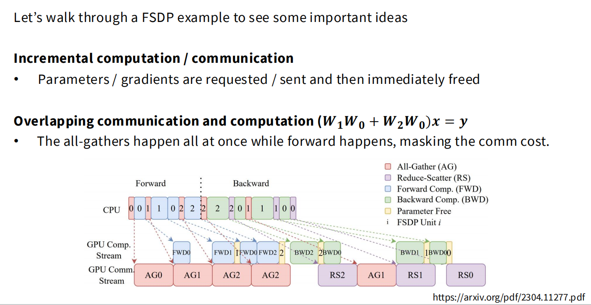

# ZeRO

## 1. ZeRO Stage 1 (优化器状态分片)

其核心思想是每个 GPU 仍然持有完整的模型参数和梯度, 但只负责维护和更新总参数量的 1/N 所对应的优化器状态 (即 Adam 的主权重, 动量和方差项).

计算步骤:
1. **计算局部梯度**: 每个 GPU 都接收其数据子集, 并执行完整的前向传播和反向传播. 每个 GPU 都计算出了该子集对应的梯度向量 (大小等于模型参数量).
2. **同步梯度**: 系统执行一次 `All-Reduce` 操作, 将所有 GPU 上的梯度向量进行逐元素求和, 并将结果广播回所有 GPU. 每个 GPU 最终都会得到一个 **完整且一致的全局梯度向量** (梯度累加并同步).
3. **本地更新参数**: 每个 GPU 从完整的全局梯度向量中分片, 同它本地存储的优化器状态分片, 来更新模型参数. 由于优化器状态是分片存储的, 每个 GPU 实际只维护和更新其负责部分参数的优化器状态和模型参数.
4. **同步参数**: 系统需要将分散的更新结果同步给所有 GPU, 通过一次 `All-Gather` 操作完成, 所有 GPU 都将得到一个由所有分片 (out) 拼接而成的完整的, 更新后的模型参数. 随后下一次迭代
重复上述操作.

ZeRO Stage 1 将朴素 DDP 中单一的 `All-Reduce` 操作分解为了 `Reduce-Scatter` 和 `All-Gather` 两个步骤. 这两个步骤的总通信成本与 `All-Reduce` 相同, 故称为"零开销", 显著节省了内存.

## 2. ZeRO Stage 2 (梯度分片)

其核心思想是: 不仅将优化器状态分片, 同样将梯度也进行分片. 每个 GPU 只负责存储和处理与它所“拥有”的参数分片相对应的梯度分片.

计算步骤:
1. **计算局部梯度**: 反向传播按参数块 (参数块按照 GPU 划分, 每个参数块对应一个 GPU 所有) 逐段进行. 所有 GPU 都基于其分配的数据子集, 计算出对当前参数块的 **局部梯度贡献**. 此时每个 GPU 内存中仅临时生成反映自身数据视角的 **梯度块**.
2. **分布式梯度累加与释放**: 根据分片约定, 非"所有者" GPU 会立即将生成的局部梯度贡献 `Reduce` 到负责该参数块的"所有者" GPU, 并在专门的缓冲区中进行累加. 累加完成后, **"所有者" GPU 最终会得到其负责参数的完整的全局梯度分片**. 同时, 发送方会立即释放临时占用的显存. 此循环随反向传播在不同参数段上重复上演.
3. **本地更新参数**: 在整个增量式反向传播结束后, 每个 GPU 从本地缓冲区中读取已累积完毕的全局梯度分片, 同它本地存储的优化器状态分片, 来更新模型参数. 每个 GPU 独立完成其负责部分参数的模型更新.
4. **同步参数**: 同 ZeRO-1 一样, 系统需要将分散的更新结果同步给所有 GPU，通过一次 All-Gather 操作完成，所有 GPU 都将得到一个由所有分片拼接而成的完整的，更新后的模型参数。随后下一次迭代重复上述操作。

ZeRO Stage 2 在通信总量上与 Stage 1 和 DDP 保持一致 (仍然是 2 倍模型参数量). 但它引入了更多的 **同步开销**, 因为通信不再是每批次一次, 而是与 **反向传播的层数** 相关, 并且需要更精细的调度. 尽管如此, 这种开销通常是可接受的, 因此称之为 “(几乎)免费 (almost free)” 的内存胜利, 因为它在不增加总通信带宽需求的情况下, 再次大幅降低了内存峰值.

## 3. ZeRO Stage 3 (FSDP - Fully Sharded Data Parallel)

Stage 3 是 ZeRO 的终极形态, 它的目标是实现完全的线性内存扩展. 之前我们在 Stage 1 解决了优化器状态的冗余, 在 Stage 2 解决了梯度的冗余, 但自始至终, 每个 GPU 都还必须在内存中保留一份完整的模型参数. 对于今天的巨型的 LLM 来说, 这是一个不可逾越的障碍.

### 3.1 核心思想

FSDP 的核心思想就是分片一切 (参数, 梯度, 优化器状态). 在训练开始时, 每个 GPU 只加载了模型参数的一个分片. 在任何时刻, 没有任何一个 GPU 拥有完整的模型.

计算步骤:

1. **加载模型分片**: 训练开始时, 每个 GPU 仅加载并维护其负责的那部分模型参数分片. 此时，GPU 的内存占用极低.
2. **前向计算与参数释放**: 当需要计算某个模型分块 (如前 N 层) 时, 系统执行一次 `All-Gather` 操作, 在所有 GPU 上 **临时重构** 出该块的完整参数. 每个 GPU 利用完整参数和本地数据执行前向计算生成激活值. 等计算一结束, 便将参数立即释放, 仅保留反向传播所需的激活值. 每计算一个模型参数块就执行一次该循环, 贯穿整个前向传播过程.
3. **反向计算与梯度规约**: 反向传播逐层进行. 当需要计算某一层梯度之前, 再次通过 `All-Gather` 临时重构出该层的完整参数. 每个 GPU 利用重构参数和保留的激活值计算出局部梯度贡献后, 系统立即执行 `Reduce-Scatter` 操作, 将局部梯度直接规约, 分发并累加到各自"所有者" GPU 的缓冲区中. 梯度发送完毕后, 临时重构的参数同样被立即释放.
4. **本地更新参数**: 在整个反向传播结束后, 每个 GPU 均已获取自己负责的模型参数分片, 对应的完整的全局梯度分片以及优化器状态分片. 每个 GPU 独立在本地完成参数更新. 此时, 更新后的模型依然以分片形式存在, 准备进入下一次循环.

可以看出, FSDP 的通信开销很大, 如果严格按照串行执行 (即等待通信完成后再开始计算), 系统效率将非常低, GPU 大部分时间会处于轮空状态.

### 3.2 FSDP 的时序

FSDP 真正能发挥作用的关键, 在于其 **通信与计算重叠** 的能力.

#### 3.2.1 计算流和通信流

现代 GPU 硬件和驱动程序允许我们同时执行不同类型的任务. FSDP 充分利用了这一点, 将任务调度到两个独立的硬件队列(或称 **流 (Stream)**)上:

- **GPU Comp. Stream (计算流)**: 专门负责执行计算密集型任务. 如前向传播 (`FWD`) 和反向传播 (`BWD`).
- **GPU Comm. Stream (通信流)**: 专门负责数据传输任务. 如 `All-Gather` (`AG`) 和 `Reduce-Scatter` (`RS`).

#### 3.2.2 预取

我们用前向传播的时间轴观察这个过程:

1. **启动**: 在开始计算前, 系统需为第一个计算块收集参数, 执行 `AG0`.
2. **并行**: 当 `AG0` 通信一完成, CPU 立即向 **计算流** 下发 `FWD0` 的指令, 同时向 **通信流** 下发 `AG1` 的指令.
3. **执行**: 随后 **计算流** 开始执行 `FWD1`, **通信流** 开始执行 `AG1`.
4. 随后重复这一循环, 保证 **计算流** 和 **通信流** 并行执行.

#### 3.2.3 效果

由图可以看出, 若一个计算块的计算时间 (`T_compute`) 大于等于下一个计算块的通信时间 (`T_comm`), 那么通信延迟相对于 0. 但现实情况往往计算时间小于通信时间, 当计算结束后, **计算流** 需短暂等待 (`bubble`) 一下. 尽管如此, 大部分的通信延迟被缓解了.

通过这种精密调度, FSDP 由原来的串行执行的总时间 (`∑(T_comm + T_compute`), 优化为了接近 `T_comm_initial + ∑(T_cmopute) + ∑(T_bubble)`. 只要 `T_bubble` 很小, 系统整体效率就由计算时间决定.

**通信总量的代价**: 在一次完整的前向 + 反向传播中, 每个参数需要:
1. 在前向传播时 `All-Gather` 一次.
2. 在反向传播时 `All-Gather` 一次.
3. 其对应的梯度在反向传播被 `Reduce-Scatter` 一次.

这导致总通信量约为 ZeRO1 和 ZeRO2 的 1.5 倍. 然而, 正因为有了强大的通信计算重叠能力, 这个增加的通信总量并没有转化为同等比例的性能下降. FSDP 用更高的总带宽需求, 换来了极致的内存效率和依然很高的计算吞吐量, 使其成为当今训练超大模型不可或缺的技术.