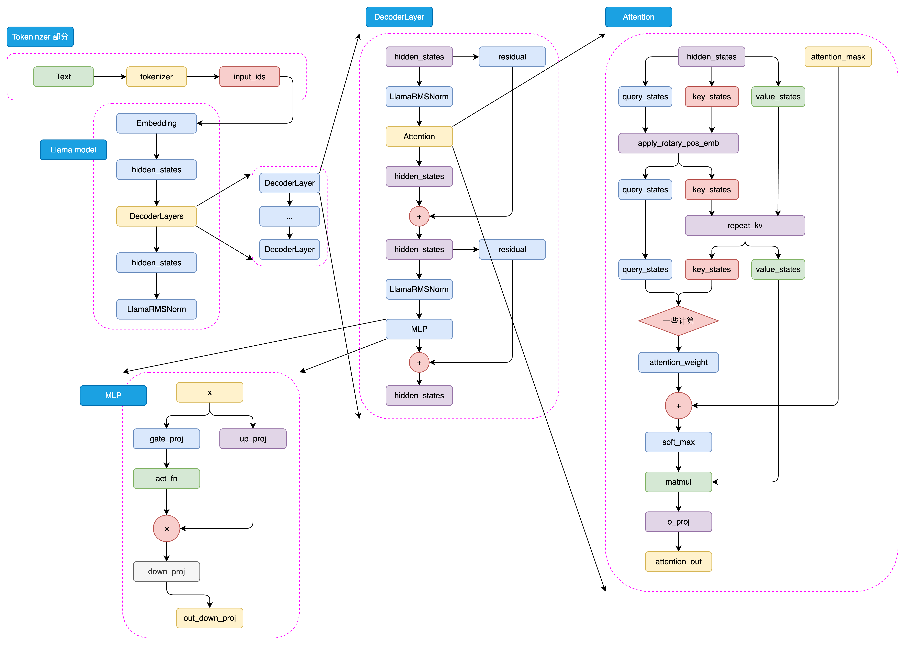

# 预训练语言模型 (Pretrain Language Model, PLM)

## 1. Encoder-only PLM

Encoder-only PLM, 顾名思义, 是只保留了 Transformer 中的 Encoder 层, 并通过堆叠得到的预训练模型. 这种模型天生适合**自然语言理解** (Natural Language Understanding, NLU) 任务.

### 1.1 BERT

BERT, 全名为 Bidirectional Encoder Representations from Transformers, 是由 Google 团队在 2018年发布的预训练语言模型.

#### 1.1.1 核心思想

BERT 是一个统一了多种思想的预训练模型. 其所沿承的核心思想包括:
- **Transformer 架构**. BERT 沿承了 Transformer 架构的思想, 在 Transformer 的模型基座上进行优化, 通过将 Encoder 结构进行堆叠, 扩大模型参数, 打造了在 NLU 任务上独居天分的模型架构.
- **预训练+微调范式** . BERT 采用了 ELMo 的训练范式 (即在训练数据上基于语言模型进行预训练, 再针对下游任务进行微调), 并通过将模型架构调整为 Transformer, 引入更适合文本理解, 能捕捉深层双向语义关系的预训练任务 MLM, 将预训练-微调范式推向了高潮.

#### 1.1.2 模型架构

BERT 抛弃了带有自回归特性的 Decoder 模块, 采用了纯编码器设计, 其主干网络完全复用并堆叠了 N 个 Encoder 层.

整体架构数据流程如下:
1. **分词 & 嵌入**: 输入的文本序列会首先通过 tokenizer 转化成 input_ids (基本每一个模型在 tokenizer 的操作都类似, 可以参考 Transformer 的 tokenizer 机制), 然后进入 Embedding 层转化为特定维度的输入向量.
2. **Encoder 模块**: 由 N 个 Encoder 层堆叠而成. 输入向量经由 Encoder 编码后掌握了文本的基本语义. (BERT 的注意力计算过程和 Transformer 的唯一差异在于, 在完成注意力分数的计算之后, 先通过 Position Embedding 层来融入相对位置信息, 通过可训练的参数来拟合相对位置. 虽然提供了更丰富的相对位置信息, 但是限制了模型输入的长度)
3. **下游分类头(prediction_heads)**: prediction_heads 主要由 两层线性层加中间的激活函数构成, 用于拟合 Encoder 模块得到的文本信息然后适配下游任务. 在不同的下游任务往往只需要在 PLM 的基础上对 prediction_heads 进行微调即可.

#### 1.1.3 预训练任务: MLM

相较于基本沿承 Transformer 的模型架构, BERT 更大的创新点在于其提出的两个新的预训练任务上: MLM (Masked Language Model, 掩码语言模型) 和 NSP (Next Sentence Prediction, 下一句预测).

**预训练-微调范式** 的核心优势在于, 通过将预训练和微调分离, 完成一次预训练的模型可以仅通过微调应用在几乎所有下游任务上. 只要微调的成本较低, 即使预训练成本是之前的数倍甚至数十倍, 模型仍然有更大的应用价值. 因此, 可以进一步扩大模型参数和预训练数据量, 使用海量的预训练语料来让模型拟合潜在语义与底层知识, 从而让模型通过长时间, 大规模的预训练获得强大的语言理解和生成能力.

这使得预训练数据需要庞大的数据规模, 故只能从无监督的语料中获取. 而传统 LM (Language Model) 任务 (即根据上文预测下文) 虽然能很好地利用无监督语料进行训练, 但其只能拟合从左到右的语义关系, 而忽略了双向的语义关系. 故 BERT 提出了 MLM 作为新的预训练任务.

**MLM 的思路** 是, 在一个文本序列中用 [MASK] 随机遮蔽掉部分 Token, 然后将所有未被遮蔽的 Token 输入模型, 要求模型根据输入预测被遮蔽的 Token. 这样模型可以拟合双向语义, 也就能够更好地实现文本的理解.

但这就出现一个问题, 在预训练时, BERT 学习了大量 [MASK], 但在微调时, 输入文本却几乎没有 [MASK], 这会造成分布偏移, 极大影响在下游任务微调的性能. 故 BERT 采用了这样的设计: 对一个文本序列, 15% 的 Token 被选作预测目标, 其中 80% 被 [MASK], 10% 替换为随机词, 10% 保持不变.

预训练时, 包含以下流程:
1. 输入文本序列, 分词并嵌入得到 `[B, L, D]`.
2. 经过 Encoder 模块后, 维度保持 `[B, L, D]`.
3. 随后经过预训练特定头 (将隐藏维度 `D` 映射到维度 `V` 上, 得到每个 Token 对词汇表所有词汇的预测概率).
4. 只计算序列中 15% 的预测目标 (`[B, M, D]`) 与真实 label 的交叉熵损失, 并进行反向传播.

#### 1.1.4 预训练任务: NSP

BERT 还设计了另一个预测任务: NSP. 其核心思想是, 要求模型判断一个句子对的两个句子是否为连续的上下文. 通过要求模型判断句对关系, 从而迫使模型拟合句子之间的关系, 来适配句级的 NLU 任务.

具体而言, BERT 在一个训练样本中引入了两个特殊标记: [CLS] (表示整个句对的聚合语义表示) 和 [SEP] (用于分隔两个句子). 一个训练样本 (句子对) 包括: `[CLS] S_A [SEP] S_B [SEP]`.

预训练时, NSP 的流程如下:
1. 构造句子对输入, 经过分词与嵌入后得到 `[B, L, D]`.
2. 经过 Encoder 模块后, 输出维度保持 `[B, L, D]`.
3. 取每个序列 [CLS] 位置的向量, 得到 `[B, D]`.
4. 随后经过特定预训练头, 将这一表示映射到二分类空间: `[B, 2]`. (0 表示是连续上下文, 1 表示否)
5. 与真实标签计算交叉熵损失, 并进行反向传播.

#### 1.1.5 下游任务微调

值得注意的是, 预训练时的 prediction_heads 是专门针对预训练任务打造的, 目的是更好地提升 Encoder 模块的文本理解能力. 故在下游任务的微调上, 需要设计适配下游任务的特定分类头. 由此, BERT 可适配多种 NLP 任务:
1. 对于**文本分类任务**, 可以直接修改模型结构中的 prediction_heads 最后的分类头即可.
2. 对于**序列标注等任务**, 可以集成 BERT 多层的隐含层向量再输出最后的标注结果.
3. 对于**文本生成任务**, 也同样可以取 Encoder 的输出直接解码得到最终生成结果. 因此, BERT 可以非常高效地应用于多种 NLP 任务.

### 1.2 RoBERTa

RoBERTa 的模型架构与 BERT 完全一致, 也就是使用了 BERT-large (24层 Encoder Layer, 1024 的隐藏层维度, 总参数量 340M) 的模型参数. 但在训练策略和分词算法上做了以下优化:

1. **去掉 NSP 任务**: RoBERTa 发现 NSP 任务过于简单, 不仅不能明显提高模型性能, 甚至可能产生负面影响. 故只保留了 MLM 任务.
2. **改进 Masking 策略**: RoBERTa 采用了动态掩码的策略: 每个训练样本在不同 epoch 中可能有不同的 mask, 从而避免模型过拟合固定的 mask 模式, 提高训练数据的多样性.
3. **更大规模的预训练数据和预训练步长**.
4. **分词算法的改进**: 采用 BPE 算法, 摒弃了 WordPiece 算法.

## 2. Encoder-Decoder PLM

虽然 BERT 在 NLU 任务上表现优异, 但仍存在一些局限, 例如 MLM 任务和下游任务微调的不一致性, 以及无法处理超过模型训练长度的输入等问题。

为了解决这些问题, 研究者提出了 Encoder-Decoder 模型, 通过引入 Decoder 部分实现 文本生成能力, 同时也为 NLP 领域提供了统一任务表示的思路.

### 2.1 T5

T5（Text-to-Text Transfer Transformer）是 Google 提出的一种 Encoder-Decoder 预训练语言模型, 它将所有 NLP 任务统一表示为 **文本到文本** 的转换问题, 从而简化模型设计并提升多任务学习能力.

#### 2.1.1 核心思想

1. **统一任务格式**: T5 将所有 NLP 任务 (文本分类, 翻译, 问答, 摘要等) 都统一表示为输入文本到输出文本的转换.
2. **Encoder-Decoder 架构**: 采用了原始 Transformer 的架构, 输入文本由 Encoder 编码, Decoder 自回归生成输出文本.
3. **多任务预训练**: T5 通过大规模预训练捕捉通用语言表示, 然后在具体任务上微调.

#### 2.1.2 模型架构

T5 基于 Transformer 架构, 包含 Encoder 和 Decoder 两部分, 每部分均由若干 Encoder layer 和 Decoder layer 组成.

#### 2.1.3 预训练任务

T5 的预训练任务主要包括以下几个部分:

1.  MLM. 同 BERT一样, 也是在输入文本中随机遮蔽15%的token, 然后让模型预测这些被遮蔽的token.
2. 预训练训练集. T5 使用了自己创建的大规模数据集"Colossal Clean Crawled Corpus"(C4).
3. 多任务预训练: T5 还尝试了将多个任务混合在一起进行预训练, 而不仅仅是单独的MLM任务.

#### 2.1.4 大一统思想

T5模型的一个核心理念是“大一统思想”, 即所有的 NLP 任务都可以统一为文本到文本的任务, 而不对具体任务作区分.

对于不同的NLP任务, 每次输入前都会加上一个任务描述前缀，明确指定当前任务的类型. 这不仅帮助模型在预训练阶段学习到不同任务之间的通用特征, 也便于在微调阶段迅速适应具体任务.

## 3. Decoder-only PLM

Decoder-Only 就是目前大火的 LLM 的基础架构, 目前所有的 LLM 基本都是 Decoder-Only 模型 (RWKV, Mamba 等非 Transformer 架构除外).

### 3.1 GPT

#### 3.1.1 模型架构

GPT 的整体结构和 BERT 很相似, 只是相较于 BERT 的 Encoder, 选择使用了 Decoder 来进行堆叠.

整体架构数据流程如下:

1. **分词&嵌入**: 输入的文本序列会首先通过 tokenizer 转化成 input_ids, 然后进入 Embedding 层, 再经过 Positional Embedding 进行位置编码, 转化为特定维度的输入向量. (不同于 BERT 选择可训练的全连接层进行位置编码, GPT 沿用了 Tansformer 的绝对位置编码).
2. **Decoder 模块**: 由 N 个 Decoder 堆叠而成. 这里的 Decoder 模块相比与 原始 Transformer 少了 Cross Attention 的计算, 仅保留了一个 Mask Self-Attention, 同时采用了 Pre-Normalization 的设计. 不同于原始 Transformer, GPT 在 MLP 层采用了两个一维卷积核来进行特征提取, 在效果上和线性层差不多.
3. **特征提取层**: 最后经由线性矩阵映射回词汇表维度, 从而转换为自然语言 Token, 生成目标序列.

#### 3.1.2 预训练任务: CLM

由于Decoder-Only 的模型结构往往更适合于文本生成任务. 因此, Decoder-Only 模型往往选择了最传统也最直接的预训练任务: 因果语言模型 (Causal Language Model, CLM).

CLM 的核心思想是基于一个自然语言序列的前面所有 token 来预测下一个 token, 通过不断重复该过程来实现目标序列的生成. 故对于一个 Token 的目标输出即为它的下一个 Token.

预训练时，包含以下流程：

1. 输入文本序列, 分词并嵌入得到 `[B, L, D]`。
2. 经过 Decoder 模块 (自回归 Transformer Decoder) 后，维度保持 `[B, L, D]`.
3. 经过预训练特定头 (线性层或 softmax 层)，将隐藏维度 D 映射到词汇表维度 V, 得到每个 token 对词汇表所有词的预测概率 `[B, L, V]`。
4. 对每个 token (通常是输入序列中除开第一个 token 外的所有 token) 计算预测概率与真实下一个 token 的交叉熵损失, 并进行反向传播.

#### 3.1.3. GPT 系列模型的演进

GPT-2 的核心贡献在于证明了语言模型在无监督状态下具备多任务处理能力, 并对网络进行了优化:
1. 将 Post Normalization 改为 Pre Normalization.
2. 放弃了 GPT-1 的“预训练 + 任务微调”模式, 转而强调零样本生成 (Zero-shot). zero-shot 则强调不使用任何训练样本, 直接通过向预训练语言模型描述问题来去解决该问题.

GPT-3 则将参数规模由 GPT-2 的 1.5B 暴力扩展到 175B, 引发了量变引起质变的涌现能力:
1. 采用了稀疏注意力机制, 以降低长序列下的显存占用.
2. 确立了 Few-shot (少样本提示) 的提示词工程范式.

### 3.2 LLaMA

LLaMA 模型是由 Meta 开发的一系列大型预训练语言模型. 由于其开源的特性, 受到了业内人士的广泛引用.

#### 3.2.1 模型架构

LLaMA 依然沿用了 GPT 系列模型的 Decoder-only 架构和 CLM 预训练范式, 但对其底层子层组件进行了系统性的优化.

LLaMA 相比于 GPT 架构作出的改进:

1. 将 LayerNorm 替换为了 **[RMSNorm (Section 3)](../basic/Normalization.md)**., 同时保留 Pre Normalization 的设计. 在保留模型精度的前提下简化了计算开销.
2. 用 **[RoPE (Section 3)](../basic/位置编码.md)** 替换了绝对位置编码. 数据在流经 Embedding 层时不注入任何位置信息. 位置信息的注入被推迟到了多头自注意力机制内部. 赋予了模型更强的长文本外推能力.
3. 在 FFN 层采用 **[SwiGLU (Section 1.3)](../basic/GLU.md)** 而非传统的线性映射层. 赋予了网络更复杂的非线性表达与特征筛选能力.
4. 注意力机制由 MHA 替换为了 **[GQA (Section 2.2)](../basic/Attention.md)**. 极大幅度地降低了自回归推理阶段的 KV Cache 显存占用.

LLaMA 的预训练流程与 GPT 基本一致, 这里不再赘述.
