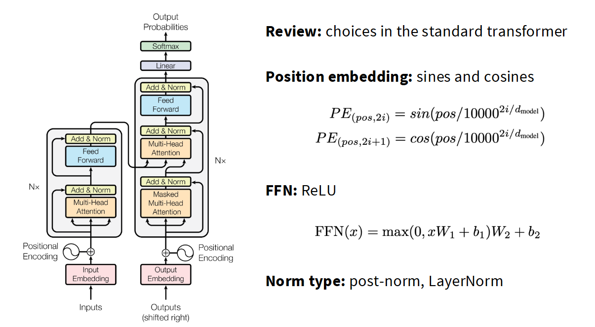

# Transformer

## 1. 原始 Transformer

按照数据流动顺序来进行介绍.

### 1.1 分词与嵌入

模型输入为一段文本, 该文本会经过以下这些操作, 得到最终的嵌入向量:

1. 该文本会首先会根据模型预设的 Tokenizer 算法对该文本进行分词, 将其中字符转换为词元.
2. 然后再根据固定窗口(通常为 max_length (L))切分为多个Token段, 每个Token段为一个序列.
3. 根据设置的超参数 batch_size (B), 每次取出对应数量的序列, 得到形状为 `[B, L]` 的整数张量. 对最后一个不足 max_length 的序列需进行填充, 同时填充后需生成 attention_mask 告知模型忽略该填充位置.
4. 对该整数张量进行嵌入, 将其转换为高维向量, 得到形状为 `[B, L, D]` 的张量 $x_{in}$. 原始Transformer论文中其维度 $d_{model}$(D) = 512.

### 1.2 位置编码

在得到 $x_{in}$ 后, 由于缺少序列中 token 的顺序信息, Transformer 的注意力机制本身无法感知词元的前后顺序, 因此需在嵌入向量中加入位置编码, 原始Transformer论文中使用的是 **[正弦绝对位置编码](./位置编码.md)**.

### 1.3 编码器 (Encoder)

在加和位置编码后, $x_{in}$ 需依次流经 N 个 Encoder层 (原始 Transformer 论文中 N 为 6). 在每个 Encoder 层内部, $x_{in}$ 需流经以下两个核心的子层:

**子层1: 多头自注意力机制**
1. 建立残差分支: $x_{res} = x_{in}$.
2. 注意力计算: $x_{in} = MultiHeadAttention(x_{in}, x_{in}, x_{in})$. (详见 **[Multi-head Attention](./Attention.md)**.)
3. 随机失活: $x_{in} = Dropout(x_{in})$.
4. 残差连接与归一化: $x_{in} = LayerNorm(x_{in} + x_{res})$ (详见 **[LayerNorm](./Normalization.md)**). 注意, 这里原始 Transformer 论文用的是 Post Normalization.

**子层2: 前馈神经网络**
1. 建立残差分支: $x_{res} = x_{in}$.
2. 前馈神经拟合: $x_{in} = Linear_2(ReLU(Linear_1(x_{in})))$ ($Linear_1$ 通常将维度 D 投影至 4 * D, $Linear_2$ 再将其降回 D).
3. 随机失活: $x_{in} = Dropout(x_{in})$.
4. 残差连接与归一化: $x_{in} = LayerNorm(x_{in} + x_{res})$.

### 1.4 解码器 (Decoder)

与 Encoder 能够一次性看到完整句子的全局视野不同, Decoder 具有严格的 **自回归性质**, 在生成阶段, 它必须从左到右逐个生成单词, 当前步的预测只能依赖已生成的历史信息. 

为了在并行训练时模拟这种性质并防止看到未来的词，Decoder 的架构设计发生了改变. 目标序列张量 $x_{out}$ 在加和位置编码后, 需依次流经 N 个 Decoder 层. 同时, 每个 Decoder 层还需接收来自整个 Encoder 模块的最终输出矩阵.

在每个 Decoder 层内部, $x_{out}$ 需依次流经以下三个核心的子层:

**子层 1: 掩码多头自注意力机制**
1. 建立残差分支: $x_{res} = x_{out}$.
2. 掩码注意力计算: $x_{out} = MaskedAttention(x_{out}, x_{out}, x_{out})$. (详见 **[Mask Self-Attention](./Attention.md)**.)
3. 随机失活: $x_{out} = Dropout(x_{out})$.
4. 残差连接与归一化: $x_{out} = LayerNorm(x_{out} + x_{res})$.

**子层 2: 多头交叉注意力机制**
1. 建立残差分支: $x_{res} = x_{out}$.
2. 交叉注意力计算: $x_{out} = MultiHeadAttention(x_{out}, x_{in}, x_{in})$. (详见 **[Cross Attention](./Attention.md)**.)
3. 随机失活: $x_{out} = Dropout(x_{out})$.
4. 残差连接与归一化: $x_{out} = LayerNorm(x_{out} + x_{res})$.

**子层 3: 前馈神经网络**
1. 建立残差分支: $x_{res} = x_{out}$.
2. 前馈神经拟合: $x_{out} = Linear_2(ReLU(Linear_1(x_{out})))$
3. 随机失活: $x_{out} = Dropout(x_{out})$.
4. 残差连接与归一化: $x_{out} = LayerNorm(x_{out} + x_{res})$.

### 1.5 线性映射与概率输出

经过 N 层 Encoder 和 Decoder 的处理后，我们得到了目标序列的最终向量 $x_{out}$, 其维度依然保持为 [B, L, D]. 接下来的目标是将这个高维特征向量映射回具体的词表空间. 以预测接下来的单词.

$x_{out}$ 需流经以下步骤:

1. 将 $x_{out}$ (`[B, L, D]`)进行线性映射, 与维度为 `[D, V]` (V 为词汇表总大小 `vocab_size`) 的权重矩阵相乘, 得到原始的得分矩阵 (`[B, L, V]`).
2. 对上述得到的得分矩阵的最后一个维度进行 Softmax 归一化, 得到总概率为 1 的概率分布矩阵. 该张量中的每一个值都代表词表中对应词元被预测为下一个词的概率.
3. 输出处理:
- **训练阶段**: 模型一次性并行输出整个序列的概率分布, 直接与真实的 labed 矩阵进行对比, 计算 **交叉熵损失**, 进行反向传播.
- **推理阶段**: 模型根据概率分布, 通过特定的解码策略挑选出当前时间步预测出的具体词元. 该词元将在嵌入编码后拼接回 $x_{out}$ 中, 作为下一轮输入重新流经整个 Decoder, 实现自回归循环.
